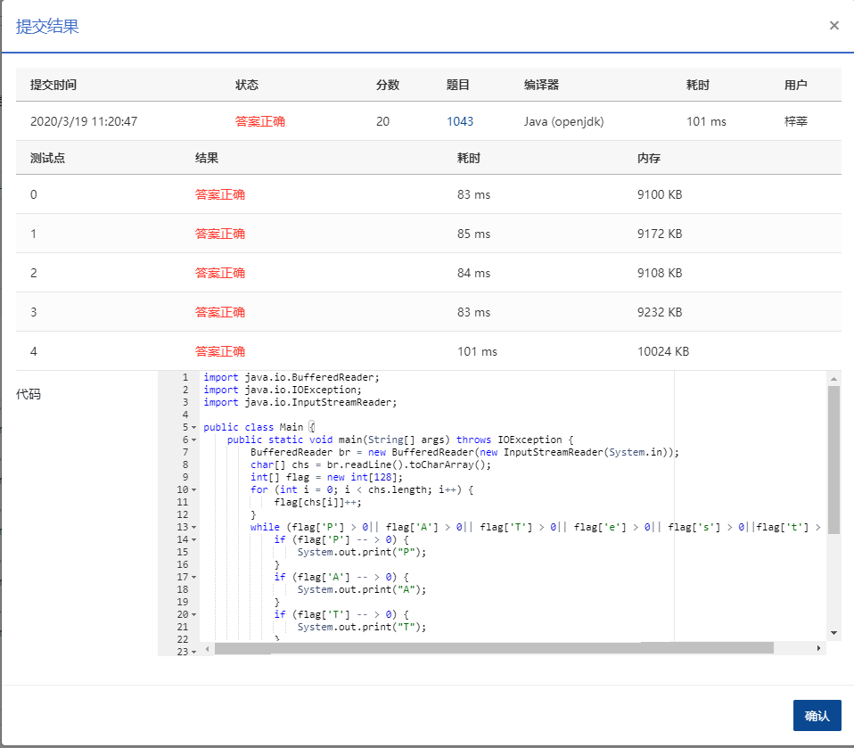

## 1043 输出PATest (20分)

给定一个长度不超过 10<sup>4</sup> 的、仅由英文字母构成的字符串。请将字符重新调整顺序，按 `PATestPATest....` 这样的顺序输出，并忽略其它字符。当然，六种字符的个数不一定是一样多的，若某种字符已经输出完，则余下的字符仍按 PATest 的顺序打印，直到所有字符都被输出。

### 输入格式：

输入在一行中给出一个长度不超过 10<sup>4</sup> 的、仅由英文字母构成的非空字符串。

### 输出格式：

在一行中按题目要求输出排序后的字符串。题目保证输出非空。

### 输入样例：

```in
redlesPayBestPATTopTeePHPereatitAPPT 
```

### 输出样例：

```out
PATestPATestPTetPTePePee
```

### 代码

```java
public static void main(String[] args) throws IOException {
		BufferedReader br = new BufferedReader(new InputStreamReader(System.in));
		char[] chs = br.readLine().toCharArray();
		br.close();
		int[] flag = new int[128];
		for (int i = 0; i < chs.length; i++) {
			flag[chs[i]]++;
		}
		while (flag['P'] > 0 || flag['A'] > 0 || flag['T'] > 0 || flag['e'] > 0 || flag['s'] > 0 || flag['t'] > 0) {
			if (flag['P']-- > 0) {
				System.out.print("P");
			}
			if (flag['A']-- > 0) {
				System.out.print("A");
			}
			if (flag['T']-- > 0) {
				System.out.print("T");
			}
			if (flag['e']-- > 0) {
				System.out.print("e");
			}
			if (flag['s']-- > 0) {
				System.out.print("s");
			}
			if (flag['t']-- > 0) {
				System.out.print("t");
			}

		}
	}
```

### 输入VS输出

```
redlesPayBestPATTopTeePHPereatitAPPT
PATestPATestPTetPTePePee
```

### 提交


