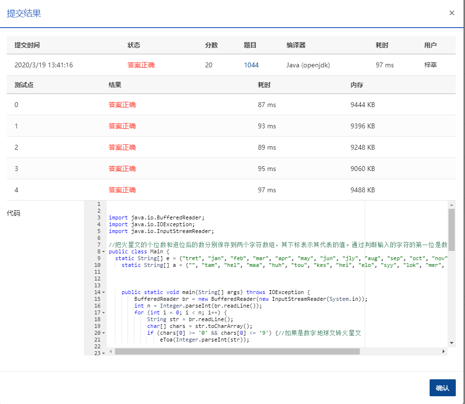

## 1044 火星数字 (20分)

火星人是以 13 进制计数的：

- 地球人的 0 被火星人称为 tret。
- 地球人数字 1 到 12 的火星文分别为：jan, feb, mar, apr, may, jun, jly, aug, sep, oct, nov, dec。
- 火星人将进位以后的 12 个高位数字分别称为：tam, hel, maa, huh, tou, kes, hei, elo, syy, lok, mer, jou。

例如地球人的数字 `29` 翻译成火星文就是 `hel mar`；而火星文 `elo nov` 对应地球数字 `115`。为了方便交流，请你编写程序实现地球和火星数字之间的互译。

### 输入格式：

输入第一行给出一个正整数 *N*（<100），随后 *N* 行，每行给出一个 [0, 169) 区间内的数字 —— 或者是地球文，或者是火星文。

### 输出格式：

对应输入的每一行，在一行中输出翻译后的另一种语言的数字。

### 输入样例：

```in
4
29
5
elo nov
tam

      
    
```

### 输出样例：

```out
hel mar
may
115
13
```

### 代码

```java
package com.zixin.algorithm;

import java.io.BufferedReader;
import java.io.IOException;
import java.io.InputStreamReader;

//把火星文的个位数和进位后的数分别保存到两个字符数组，其下标表示其代表的值。通过判断输入的字符的第一位是数字还是字母来判断输出的是地球文还是
public class PATB1044 {
	static String[] e = {"tret", "jan", "feb", "mar", "apr", "may", "jun", "jly", "aug", "sep", "oct", "nov", "dec"};
    static String[] a = {"", "tam", "hel", "maa", "huh", "tou", "kes", "hei", "elo", "syy", "lok", "mer", "jou"};


    public static void main(String[] args) throws IOException {
        BufferedReader br = new BufferedReader(new InputStreamReader(System.in));
        int n = Integer.parseInt(br.readLine());
        for (int i = 0; i < n; i++) {
            String str = br.readLine();
            char[] chars = str.toCharArray();
            if (chars[0] >= '0' && chars[0] <= '9') {//如果是数字地球文转火星文
                eToa(Integer.parseInt(str));

            }else {
                System.out.println(aToe(str));
            }
        }

    }

    // 外星文转地球
    private static int aToe(String str){
        int result = 0;
        String low = str.substring(str.length() - 3);
        for (int i = 0; i < 13; i++) {
            if (e[i].equals(low)) {
                result += i;
                break;
            }
            else if (a[i].equals(low)) {
                result += (i*13);
                break;
            }
        }
        if (str.length() > 4) {
            for (int i = 0; i < 13; i++) {
                if (a[i].equals(str.substring(0,3))) {
                    result += i * 13;
                    break;
                }
            }
        }
        return result;
    }

    // 地球转外星文
    private static void eToa(int res){
        if (res/13 != 0)
            System.out.print(a[res/13]);
        if (res / 13 != 0 && res % 13 != 0)
            System.out.print(" " + e[res % 13]);
        if (res/13 == 0)
            System.out.print(e[res % 13]);
        System.out.println();
    }

}

```

### 提交




