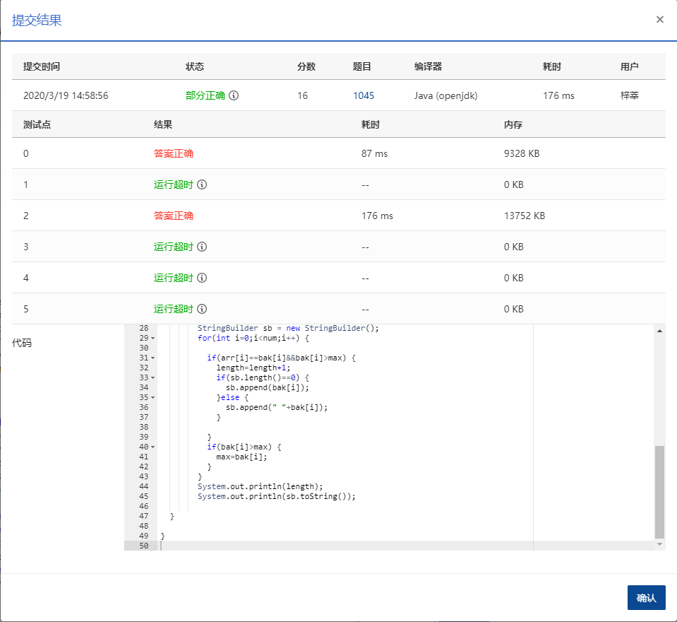

## 1045 快速排序 (25分)

超时待完善

著名的快速排序算法里有一个经典的划分过程：我们通常采用某种方法取一个元素作为主元，通过交换，把比主元小的元素放到它的左边，比主元大的元素放到它的右边。 给定划分后的 *N* 个互不相同的正整数的排列，请问有多少个元素可能是划分前选取的主元？

例如给定 $N = 5$, 排列是1、3、2、4、5。则：

- 1 的左边没有元素，右边的元素都比它大，所以它可能是主元；
- 尽管 3 的左边元素都比它小，但其右边的 2 比它小，所以它不能是主元；
- 尽管 2 的右边元素都比它大，但其左边的 3 比它大，所以它不能是主元；
- 类似原因，4 和 5 都可能是主元。

因此，有 3 个元素可能是主元。

### 输入格式：

输入在第 1 行中给出一个正整数 *N*（≤10<sup>5</sup>）； 第 2 行是空格分隔的 *N* 个不同的正整数，每个数不超过 10<sup>9</sup>。

### 输出格式：

在第 1 行中输出有可能是主元的元素个数；在第 2 行中按递增顺序输出这些元素，其间以 1 个空格分隔，行首尾不得有多余空格。

### 输入样例：

```in
5
1 3 2 4 5
```

### 输出样例：

```out
3
1 4 5
```

```java
package com.zixin.algorithm;

import java.io.BufferedReader;
import java.io.IOException;
import java.io.InputStreamReader;
import java.io.StreamTokenizer;
import java.util.Arrays;
import java.util.Scanner;

/**
 * 给a[i]做个递增排序。如果一个元素动了那么肯定不满足要求。所以首先是排序后不动。其次它得大于左边所有数字的最大值。
 * @author sangliping
 *
 */
public class PATB1045 {

	public static void main(String[] args) throws IOException {
		//Scanner sc = new Scanner(System.in);  使用Scanner  只有一个通过剩下全超时，换成下面这个有一个不超时  待优化
		BufferedReader bf = new BufferedReader(new InputStreamReader(System.in));//buff加快读取速度
		 StreamTokenizer st = new StreamTokenizer(bf);
        //int  num = sc.nextInt();
		st.nextToken();
		int  num=(int)st.nval;
        int [] arr = new int[num];
        int [] bak = new int[num];
        for(int i=0;i<num;i++) {
        	st.nextToken();
        	arr[i]=(int)st.nval;
        	bak[i]=arr[i];
        }
        int max=0;
        bf.close();
        Arrays.sort(arr);
        int length=0;
        StringBuilder sb = new StringBuilder();
        for(int i=0;i<num;i++) {
        	
        	if(arr[i]==bak[i]&&bak[i]>max) {
        		length=length+1;
        		if(sb.length()==0) {
        			sb.append(bak[i]);
        		}else {
        			sb.append(" "+bak[i]);
        		}
        		
        	}
        	if(bak[i]>max) {
        		max=bak[i];
        	}
        }
        System.out.println(length);
        System.out.println(sb.toString());
       
	}

}


```

### 输入VS输出

```java
5
1 3 2 4 5
3
1 4 5

```

### 提交

