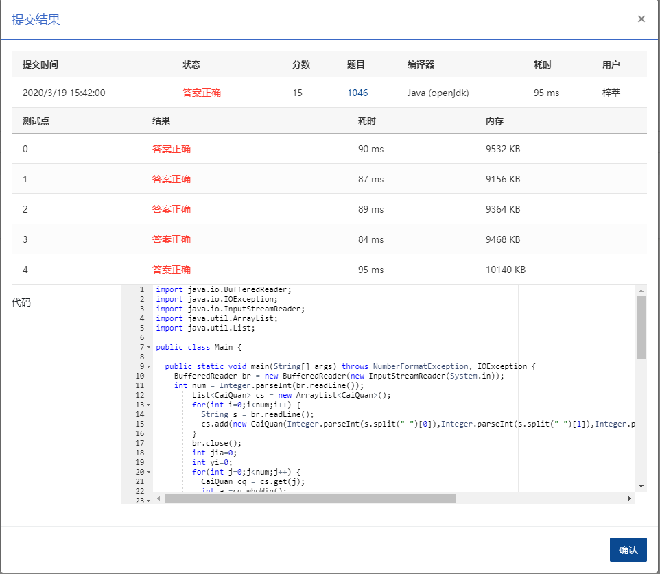

1046 划拳 (15分)

划拳是古老中国酒文化的一个有趣的组成部分。酒桌上两人划拳的方法为：每人口中喊出一个数字，同时用手比划出一个数字。如果谁比划出的数字正好等于两人喊出的数字之和，谁就赢了，输家罚一杯酒。两人同赢或两人同输则继续下一轮，直到唯一的赢家出现。

下面给出甲、乙两人的划拳记录，请你统计他们最后分别喝了多少杯酒。

### 输入格式：

输入第一行先给出一个正整数 *N*（≤100），随后 *N* 行，每行给出一轮划拳的记录，格式为：

```
甲喊 甲划 乙喊 乙划

```

其中`喊`是喊出的数字，`划`是划出的数字，均为不超过 100 的正整数（两只手一起划）。

### 输出格式：

在一行中先后输出甲、乙两人喝酒的杯数，其间以一个空格分隔。

### 输入样例：

```in
5
8 10 9 12
5 10 5 10
3 8 5 12
12 18 1 13
4 16 12 15

      
    
```

### 输出样例：

```out
1 2
```

### 代码

```java
package com.zixin.algorithm;

import java.io.BufferedReader;
import java.io.IOException;
import java.io.InputStreamReader;
import java.util.ArrayList;
import java.util.List;

public class PATB1046 {

	public static void main(String[] args) throws NumberFormatException, IOException {
		BufferedReader br = new BufferedReader(new InputStreamReader(System.in));
		int num = Integer.parseInt(br.readLine());
        List<CaiQuan> cs = new ArrayList<CaiQuan>();
        for(int i=0;i<num;i++) {
        	String s = br.readLine();
        	cs.add(new CaiQuan(Integer.parseInt(s.split(" ")[0]),Integer.parseInt(s.split(" ")[1]),Integer.parseInt(s.split(" ")[2]),Integer.parseInt(s.split(" ")[3])));
        }
        br.close();
        int jia=0;
        int yi=0;
        for(int j=0;j<num;j++) {
        	CaiQuan cq = cs.get(j);
        	int a =cq.whoWin();
        	if(a==2) {
        		jia+=1;
        	}else if(a==1) {
        		yi+=1;
        	}
        			
        }
        System.out.println(jia +" "+ yi);
		

	}

	static class CaiQuan {
		int jiahan;
		int jiachu;
		int yihan;
		int yichu;

		public CaiQuan(int jiahan, int jiachu, int yihan, int yichu) {
			super();
			this.jiahan = jiahan;
			this.jiachu = jiachu;
			this.yihan = yihan;
			this.yichu = yichu;
		}
        /**
                           * 返回1  甲赢   返回2乙赢   返回0平局
         * @return
         */
		int whoWin() {
			if (jiachu == (jiahan + yihan)&&jiachu!=yichu) {
				return 1;
			} else if (yichu == (jiahan + yihan)&&jiachu!=yichu) {
				return 2;
			} else {
				return 0;
			}
		}

	}
}

```

### 提交



