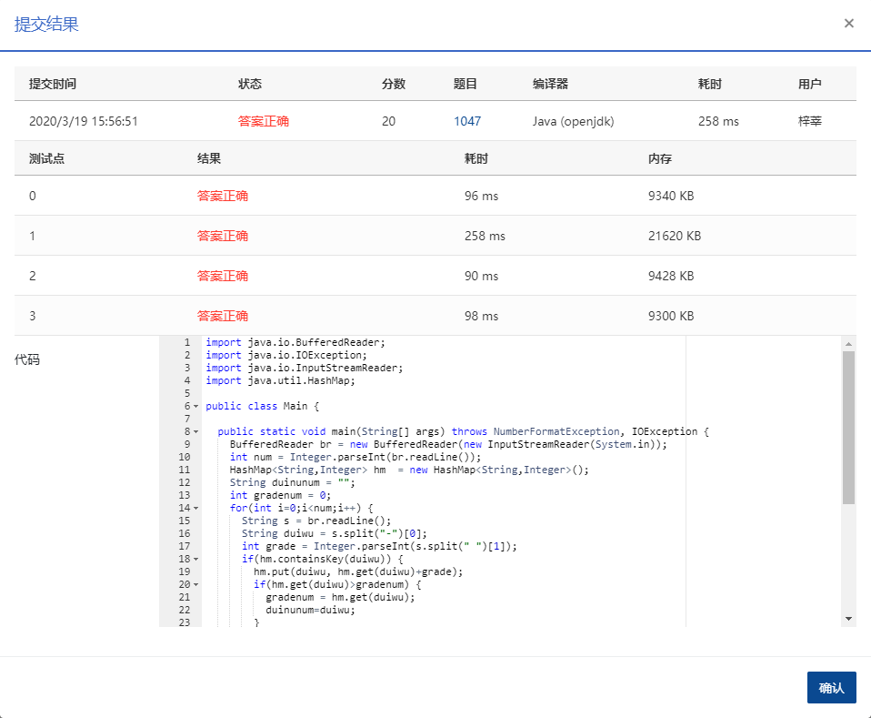

1047 编程团体赛 (20分)

编程团体赛的规则为：每个参赛队由若干队员组成；所有队员独立比赛；参赛队的成绩为所有队员的成绩和；成绩最高的队获胜。

现给定所有队员的比赛成绩，请你编写程序找出冠军队。

### 输入格式：

输入第一行给出一个正整数 *N*（≤104），即所有参赛队员总数。随后 *N* 行，每行给出一位队员的成绩，格式为：`队伍编号-队员编号 成绩`，其中`队伍编号`为 1 到 1000 的正整数，`队员编号`为 1 到 10 的正整数，`成绩`为 0 到 100 的整数。

### 输出格式：

在一行中输出冠军队的编号和总成绩，其间以一个空格分隔。注意：题目保证冠军队是唯一的。

### 输入样例：

```in
6
3-10 99
11-5 87
102-1 0
102-3 100
11-9 89
3-2 61
```

### 输出样例：

```out
11 176
```

### 代码

```java
package com.zixin.algorithm;

import java.io.BufferedReader;
import java.io.IOException;
import java.io.InputStreamReader;
import java.util.HashMap;

public class PATB1047 {

	public static void main(String[] args) throws NumberFormatException, IOException {
		BufferedReader br = new BufferedReader(new InputStreamReader(System.in));
		int num = Integer.parseInt(br.readLine());
		HashMap<String,Integer> hm  = new HashMap<String,Integer>();
		String duinunum = "";
		int gradenum = 0;
		for(int i=0;i<num;i++) {
			String s = br.readLine();
			String duiwu = s.split("-")[0];
			int grade = Integer.parseInt(s.split(" ")[1]);
			if(hm.containsKey(duiwu)) {
				hm.put(duiwu, hm.get(duiwu)+grade);
				if(hm.get(duiwu)>gradenum) {
					gradenum = hm.get(duiwu);
					duinunum=duiwu;
				}
			}else {
				hm.put(duiwu, grade);
				if(grade>gradenum) {
					gradenum = grade;
					duinunum=duiwu;
				}
			}
		}
		br.close();
		System.out.println(duinunum+" "+gradenum);

	}

	
}

```

### 输入VS输出

```java
6
3-10 99
11-5 87
102-1 0
102-3 100
11-9 89
3-2 61
11 176

```

### 提交

