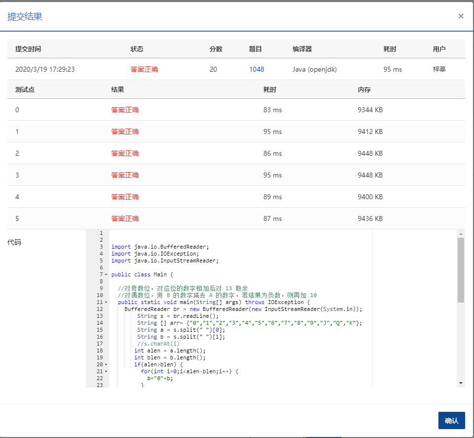

1048 数字加密 (20分)

本题要求实现一种数字加密方法。首先固定一个加密用正整数 A，对任一正整数 B，将其每 1 位数字与 A 的对应位置上的数字进行以下运算：对奇数位，对应位的数字相加后对 13 取余——这里用 J 代表 10、Q 代表 11、K 代表 12；对偶数位，用 B 的数字减去 A 的数字，若结果为负数，则再加 10。这里令个位为第 1 位。

### 输入格式：

输入在一行中依次给出 A 和 B，均为不超过 100 位的正整数，其间以空格分隔。

### 输出格式：

在一行中输出加密后的结果。

### 输入样例：

```in
1234567 368782971
```

### 输出样例：

```out
3695Q8118
```

### 代码

```java
package com.zixin.algorithm;

import java.io.BufferedReader;
import java.io.IOException;
import java.io.InputStreamReader;

/**
 * 注意a b长度不一致  都需要处理
 * @author sangliping
 *
 */
public class PATB1048 {

	//对奇数位，对应位的数字相加后对 13 取余
	//对偶数位，用 B 的数字减去 A 的数字，若结果为负数，则再加 10
	public static void main(String[] args) throws IOException {
		BufferedReader br = new BufferedReader(new InputStreamReader(System.in));
        String s = br.readLine();
        String [] arr= {"0","1","2","3","4","5","6","7","8","9","J","Q","K"};
        String a = s.split(" ")[0];
        String b = s.split(" ")[1];
        //s.charAt(i)
       int alen = a.length();
       int blen = b.length();
       if(alen>blen) {
    	   for(int i=0;i<alen-blen;i++) {
    		   b="0"+b;
    	   }
       }
       if(alen<blen) {
    	   for(int i=0;i<blen-alen;i++) {
    		   a="0"+a;
    	   }
       }
       boolean flag = ((b.length())%2==0);
       for(int i=0;i<b.length();i++) {
    	   if(flag) {
    		    int temp = b.charAt(i)-a.charAt(i);
    		    if(temp<0) {
    		    	temp=temp+10;
    		    }
    		    System.out.print(temp);
    		    flag=!flag;
    	   }else {
    		   System.out.print(arr[(b.charAt(i)-'0'+a.charAt(i)-'0')%13]);
    		   flag=!flag;
    	   }
       }
        
	}
	
	

}

```

### 输入VS输出

```
1234567 368782971
3695Q8118
```

### 提交

