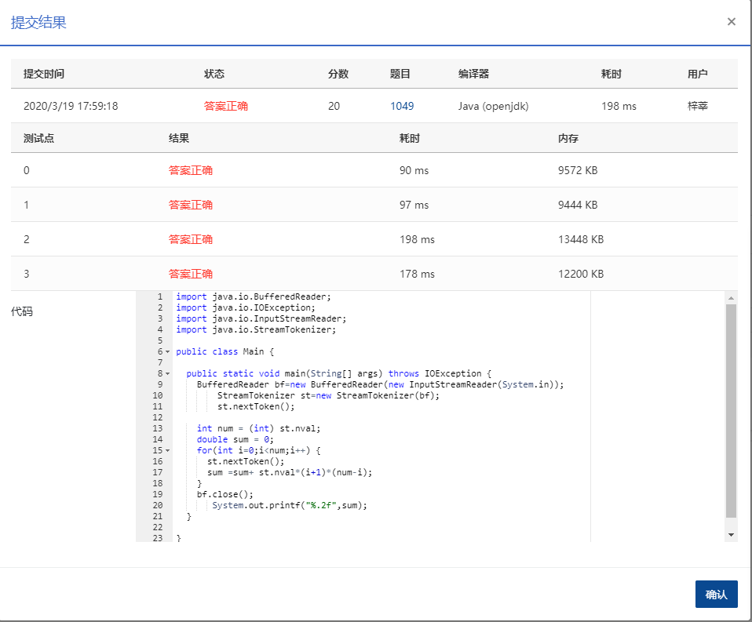

1049 数列的片段和 (20分)

给定一个正数数列，我们可以从中截取任意的连续的几个数，称为片段。例如，给定数列 { 0.1, 0.2, 0.3, 0.4 }，我们有 (0.1) (0.1, 0.2) (0.1, 0.2, 0.3) (0.1, 0.2, 0.3, 0.4) (0.2) (0.2, 0.3) (0.2, 0.3, 0.4) (0.3) (0.3, 0.4) (0.4) 这 10 个片段。

给定正整数数列，求出全部片段包含的所有的数之和。如本例中 10 个片段总和是 0.1 + 0.3 + 0.6 + 1.0 + 0.2 + 0.5 + 0.9 + 0.3 + 0.7 + 0.4 = 5.0。

### 输入格式：

输入第一行给出一个不超过 105 的正整数 *N*，表示数列中数的个数，第二行给出 *N* 个不超过 1.0 的正数，是数列中的数，其间以空格分隔。

### 输出格式：

在一行中输出该序列所有片段包含的数之和，精确到小数点后 2 位。

### 输入样例：

```in
4
0.1 0.2 0.3 0.4  
```

### 输出样例：

```out
5.00
```

### 思路

要观察规律每个出现的次数，暴力解决肯定超时。一开始规律自己还是没找出来，下方分析来自网络。

分析：将数列中的每个数字读取到temp中，假设我们选取的片段中包括temp，且这个片段的首尾指针分别为p和q，那么对于p，有i种选择，即12…i，对于q，有n-i+1种选择，即i, i+1, … n，所以p和q组合形成的首尾片段有i \* (n-i+1)种，因为每个里面都会出现temp，所以temp引起的总和为temp \* i \* (n – i + 1)；遍历完所有数字，将每个temp引起的总和都累加到sum中，最后输出sum的值

### 代码

```java
package com.zixin.algorithm;

import java.io.BufferedReader;
import java.io.IOException;
import java.io.InputStreamReader;
import java.io.StreamTokenizer;

/**
 * 使用Scanner 和BufferedReader均超时  需要使用StreamTokenizer
 * @author sangliping
 *
 */
public class PATB1049 {

	public static void main(String[] args) throws IOException {
		BufferedReader bf=new BufferedReader(new InputStreamReader(System.in));
        StreamTokenizer st=new StreamTokenizer(bf);
        st.nextToken();

		int num = (int) st.nval;
		double sum = 0;
		for(int i=0;i<num;i++) {
			st.nextToken();
			sum =sum+ st.nval*(i+1)*(num-i);
		}
		bf.close();
       System.out.printf("%.2f",sum);//格式化输出
	}

}


```

### 输入VS输出

```
4
0.1 0.2 0.3 0.4
5.00
```

### 提交

