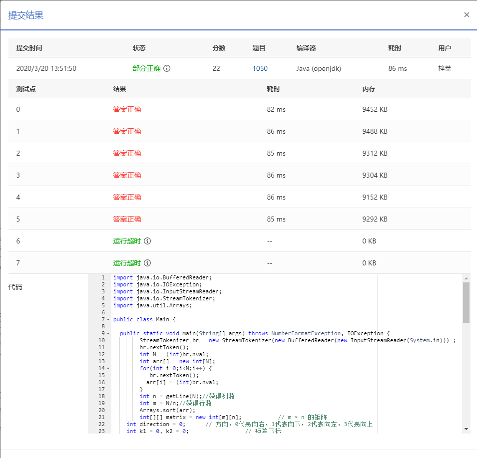

1050 螺旋矩阵 (25分)

本题要求将给定的 *N* 个正整数按非递增的顺序，填入“螺旋矩阵”。所谓“螺旋矩阵”，是指从左上角第 1 个格子开始，按顺时针螺旋方向填充。要求矩阵的规模为 *m* 行 *n* 列，满足条件：*m*×*n* 等于 *N*；*m*≥*n*；且 *m*−*n* 取所有可能值中的最小值。

### 输入格式：

输入在第 1 行中给出一个正整数 *N*，第 2 行给出 *N* 个待填充的正整数。所有数字不超过 104，相邻数字以空格分隔。

### 输出格式：

输出螺旋矩阵。每行 *n* 个数字，共 *m* 行。相邻数字以 1 个空格分隔，行末不得有多余空格。

### 输入样例：

```in
12
37 76 20 98 76 42 53 95 60 81 58 93 
```

### 输出样例：

```out
98 95 93
42 37 81
53 20 76
58 60 76
```

### 代码

```java
package com.zixin.algorithm;

import java.io.BufferedReader;
import java.io.IOException;
import java.io.InputStreamReader;
import java.io.StreamTokenizer;
import java.util.Arrays;

/**
 * 
 * @author sangliping
 * 1、求行列的时候先开方 然后再递减
 * 2、打印的时候新建一个数组，然后左->右->下->左->上 一圈一圈的打印  判断是否越界和未赋值
 *   右无法走 就向下 下走完就左 ，左走完就上
 *
 */
public class PATB1050 {

	public static void main(String[] args) throws NumberFormatException, IOException {
		StreamTokenizer br = new StreamTokenizer(new BufferedReader(new InputStreamReader(System.in)));
		br.nextToken();
		int N = (int) br.nval;
		int arr[] = new int[N];
		for (int i = 0; i < N; i++) {
			br.nextToken();
			arr[i] = (int) br.nval;
		}
		int n = getLine(N);// 获得列数
		int m = N / n;// 获得行数
		Arrays.sort(arr);//使用默认的排序方式
		int[][] matrix = new int[m][n]; // 构建一个m × n 的矩阵
		int direction = 0; // 方向，0代表左向右，1代表上向下，2代表右向左，3代表下向上
		int k1 = 0, k2 = 0; // 矩阵下标 k1代表行  k2代表列
		for (int i = N - 1; i >= 0; --i) { // 因为默认排序是升序  所以这里倒着取所有数
			matrix[k1][k2] = arr[i]; // 赋值给矩阵  第一个开始的是左上角【0，0】的位置
			switch (direction) { // 方向
			case 0: // 向右
				if (k2 + 1 < n && 0 == matrix[k1][k2 + 1]) {// 右边未越界且未赋值 
					++k2; // 向右移动
				} else { // 右边越界或已经赋值
					++k1; // 向下移动
					direction = 1; // 改变方向为向下
				}
				break;
			case 1: // 向下
				if (k1 + 1 < m && 0 == matrix[k1 + 1][k2]) {// 下边未越界且未赋值
					++k1; // 向下移动
				} else { // 下边越界或已经赋值
					--k2; // 向左移动
					direction = 2; // 改变方向为向左
				}
				break;
			case 2: // 向左
				if (k2 - 1 >= 0 && 0 == matrix[k1][k2 - 1]) {// 左边未越界且未赋值
					--k2; // 向左移动
				} else { // 左边越界或已经赋值
					--k1; // 向上移动
					direction = 3; // 改变方向为向上
				}
				break;
			default: // 向上
				if (k1 - 1 >= 0 && 0 == matrix[k1 - 1][k2]) {// 上边未越界且未赋值
					--k1; // 向上移动
				} else { // 上边越界或已经赋值
					++k2; // 向右移动
					direction = 0; // 改变方向为向右
				}
			}
		}

		for (int i = 0; i < m; ++i) {
			for (int j = 0; j < n - 1; ++j) {
				System.out.print(matrix[i][j] + " "); // 输出矩阵
			}
			System.out.println(matrix[i][n - 1]);
		}
	}

	// 满足条件：m×n 等于 N；m≥n；且 m−n 取所有可能值中的最小值。 这里返回的是列数
	private static int getLine(int n) {
		int temp = (int) Math.sqrt(n);
		while (n % temp != 0) {
			temp = temp - 1;
		}
		// System.out.println(temp);
		return temp;
	}

}

```

### 输入VS输出

```
12
37 76 20 98 76 42 53 95 60 81 58 93
98 95 93
42 37 81
53 20 76
58 60 76

```

### 提交


