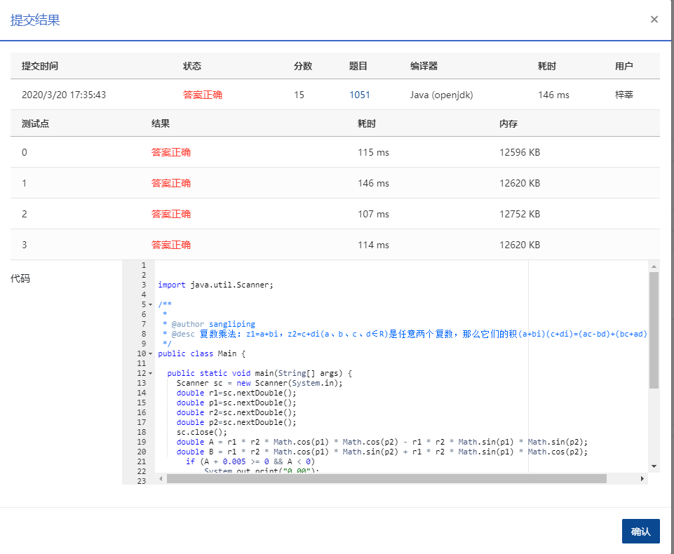

1051 复数乘法 (15分)

复数可以写成 (*A*+Bi) 的常规形式，其中 *A* 是实部，*B* 是虚部，*i* 是虚数单位，满足 i<sup>2</sup>=−1；也可以写成极坐标下的指数形式 (*R*×e(<sup>Pi</sup>))，其中 *R* 是复数模，*P* 是辐角，*i* 是虚数单位，其等价于三角形式 *R*(cos(*P*)+*i*sin(*P*))。

现给定两个复数的 *R* 和 *P*，要求输出两数乘积的常规形式。

### 输入格式：

输入在一行中依次给出两个复数的 *R*1, *P*1, *R*2, *P*2，数字间以空格分隔。

### 输出格式：

在一行中按照 `A+Bi` 的格式输出两数乘积的常规形式，实部和虚部均保留 2 位小数。注意：如果 `B` 是负数，则应该写成 `A-|B|i` 的形式。

### 输入样例：

```in
2.3 3.5 5.2 0.4

      
    
```

### 输出样例：

```out
-8.68-8.23i
```

### 代码

```java
package com.zixin.algorithm;

import java.util.Scanner;

/**
 * 
 * @author sangliping
 * @desc 复数乘法：z1=a+bi，z2=c+di(a、b、c、d∈R)是任意两个复数，那么它们的积(a+bi)(c+di)=(ac-bd)+(bc+ad)i.
 * 当A或者B小于0但是大于-0.005(比如-0.00001)时候，如果按照A>=0的判断，会输出“-0.00”这样的结果,事实上应该输出“0.00”【B同理，应该输出“+0.00i”】
 */
public class PATB1051 {

	public static void main(String[] args) {
		Scanner sc = new Scanner(System.in);
		double r1=sc.nextDouble();
		double p1=sc.nextDouble();
		double r2=sc.nextDouble();
		double p2=sc.nextDouble();
		sc.close();
		double A = r1 * r2 * Math.cos(p1) * Math.cos(p2) - r1 * r2 * Math.sin(p1) * Math.sin(p2);
		double B = r1 * r2 * Math.cos(p1) * Math.sin(p2) + r1 * r2 * Math.sin(p1) * Math.cos(p2);
	    if (A + 0.005 >= 0 && A < 0)
	        System.out.println("0.00");
	    else
	    	System.out.printf("%.2f", A);
	    if(B >= 0)
	    	System.out.printf("+%.2fi", B);
	    else if (B + 0.005 >= 0 && B < 0)
	    	System.out.printf("+0.00i");
	    else
	    	System.out.printf("%.2fi", B);
	    
		
	}
}

```

### 输入VS输出

```
2.3 3.5 5.2 0.4
-8.68-8.23i
```

### 提交

