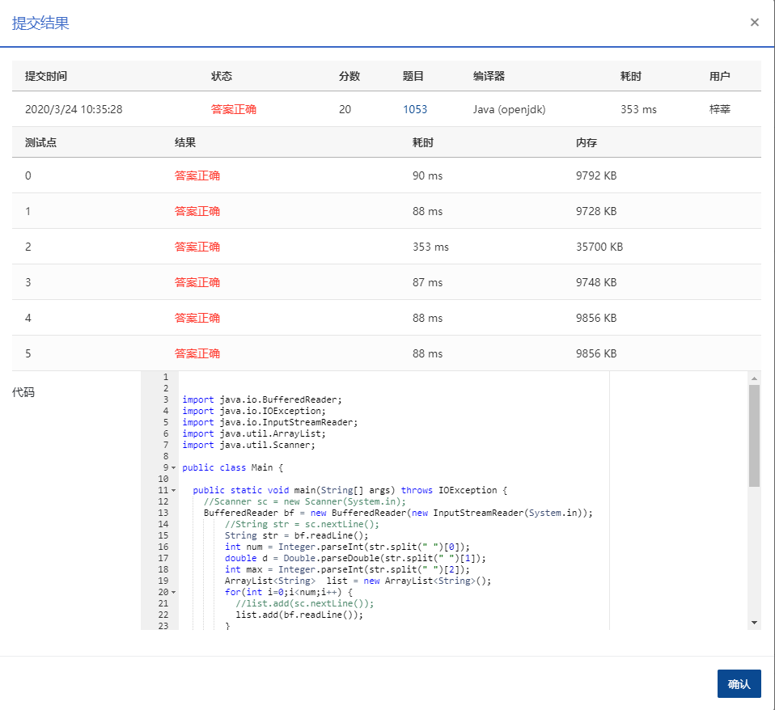

在不打扰居民的前提下，统计住房空置率的一种方法是根据每户用电量的连续变化规律进行判断。判断方法如下：

- 在观察期内，若存在超过一半的日子用电量低于某给定的阈值 *e*，则该住房为“可能空置”；
- 若观察期超过某给定阈值 *D* 天，且满足上一个条件，则该住房为“空置”。

现给定某居民区的住户用电量数据，请你统计“可能空置”的比率和“空置”比率，即以上两种状态的住房占居民区住房总套数的百分比。

### 输入格式：

输入第一行给出正整数 *N*（≤1000），为居民区住房总套数；正实数 *e*，即低电量阈值；正整数 *D*，即观察期阈值。随后 *N* 行，每行按以下格式给出一套住房的用电量数据：

K E<sub>1</sub> E<sub>2 </sub>... E<sub>K</sub>

其中 *K* 为观察的天数，E<sub>i </sub>为第 *i* 天的用电量。

### 输出格式：

在一行中输出“可能空置”的比率和“空置”比率的百分比值，其间以一个空格分隔，保留小数点后 1 位。

### 输入样例：

```in
5 0.5 10
6 0.3 0.4 0.5 0.2 0.8 0.6
10 0.0 0.1 0.2 0.3 0.0 0.8 0.6 0.7 0.0 0.5
5 0.4 0.3 0.5 0.1 0.7
11 0.1 0.1 0.1 0.1 0.1 0.1 0.1 0.1 0.1 0.1 0.1
11 2 2 2 1 1 0.1 1 0.1 0.1 0.1 0.1

      
    
```

### 输出样例：

```out
40.0% 20.0%

      
    
```

（样例解释：第2、3户为“可能空置”，第4户为“空置”，其他户不是空置。）

### 代码

```java
package com.zixin.algorithm;

import java.io.BufferedReader;
import java.io.IOException;
import java.io.InputStreamReader;
import java.util.ArrayList;
import java.util.Scanner;

public class PATB1053 {

	public static void main(String[] args) throws IOException {
		//Scanner sc = new Scanner(System.in);  使用scanner有一个超时
		BufferedReader bf = new BufferedReader(new InputStreamReader(System.in));
        //String str = sc.nextLine();
        String str = bf.readLine();
        int num = Integer.parseInt(str.split(" ")[0]);
        double d = Double.parseDouble(str.split(" ")[1]);
        int max = Integer.parseInt(str.split(" ")[2]);
        ArrayList<String>  list = new ArrayList<String>();
        for(int i=0;i<num;i++) {
        	//list.add(sc.nextLine());
        	list.add(bf.readLine());
        }
        
        //sc.close();
        bf.close();
        int maybeEmpty = 0;
        int empty=0;
        for(int i=0;i<list.size();i++) {
        	int lessThanNum = 0 ;
        	
        	String[] temp = list.get(i).split(" ");
        	for(int j=1;j<temp.length;j++) {
        		if(Double.parseDouble(temp[j])<d) {
        			lessThanNum++;
        		};
        	}
        	if(lessThanNum>(Integer.parseInt(temp[0])/2)) {
        		if(Integer.parseInt(temp[0])>max) {
        			empty++;
        		}else {
        			maybeEmpty++;
        		}
    		}
        }
        
        //System.out.println(maybeEmpty*100.0/num+"% "+empty*100.0/num+"%");
        System.out.printf("%.1f%% %.1f%%", maybeEmpty*100.0/num, empty*100.0/num);
	}

}

```

### 输入VS输出

```java
5 0.5 10
6 0.3 0.4 0.5 0.2 0.8 0.6
10 0.0 0.1 0.2 0.3 0.0 0.8 0.6 0.7 0.0 0.5
5 0.4 0.3 0.5 0.1 0.7
11 0.1 0.1 0.1 0.1 0.1 0.1 0.1 0.1 0.1 0.1 0.1
11 2 2 2 1 1 0.1 1 0.1 0.1 0.1 0.1
40.0% 20.0%
```

### 提交

