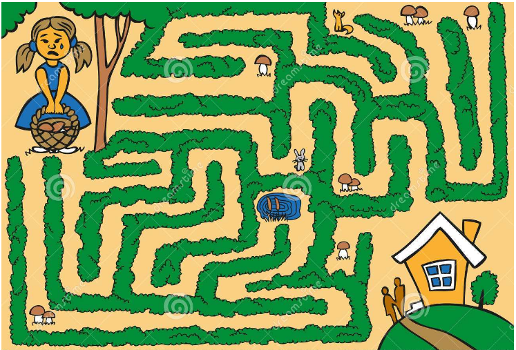

## 深度优先搜索
## 深度优先搜索DFS

搜索是一直初始状态和目标状态，对问题的中间状态进行枚举和便利的一种接替算法，所以说搜索是一种变化的和复杂的枚举。

枚举的过程一般简单，且变化较少，如：需枚举的变量较少，循环的层数固定，每一个变量的枚举范围相对固定，可循的数学规律较少，比较简单，且不能回撤。

搜索从本质上来说是枚举，但是搜索更灵活，更加能给体现智能逻辑的魅力，基于枚举思想的搜索较其母体有很多不可替代的优势，如：循环的层数是可变化的，动态的，可以把抽象的、复杂的数学逻辑规律统一起来，简便的对枚举遍历过程进行管理，同时也可以利用这些规律减少枚举量。

假设我们处于一个迷宫中，我们要想办法走出去，如下是一种看上去很盲目但是很有效的方法。



假设从左下角位置开始为起点，沿着一条路向前走，当碰到岔道口时，选择一个岔道口前进，如果这个岔口是一个死路，就退回到当前这个岔道口，选择另一个岔口前进，如果岔道口存在新的岔道口，仍然按照这种方式进行，这样只要有出口，就一定能找到。

也就是说，碰到岔道口时总是以深度作为前进的关键词，不碰到死胡同就不回头，因此叫深度优先搜索。

## 深度优先搜索（DFS）-回溯法

**回溯算法**：从问题的某一种可能情况出发，搜索所有能达到的可能情况，然后再以其中的一种可能情况作为新的出发点，继续向下探求，这样就走出了一条路。当这一条路走到尽头但仍然没有找到目标值的时候再倒回到上一个出发点，从另一个可能的情况出发，这种不断回溯寻找目标的方法，叫回溯法，回溯算法是所有搜索算法中最基本的一种算法

**算法思想**：回溯法的基本思想是穷举搜索，一般适用于寻找解集或找出满足某些约束条件的最优解，这些问题所具有的共性是顺序性，即必须先探求第一步，确定第一步采取的可能值，再探求第二部采取的可能只，然后是第三步，直到达到目标状态。

**实现步骤**：一般采用递归程序来实现回溯的算法，在实现过程中，我们把问题分为n步完成，每一步都要解决相同的问题。因此，我们首先要从题目中分析出每一步具体是什么问题，接着把每一步的所有可能列出来。

### 例一 

下面来看一个相关的题：排列的问题

> 老师布置了一道作业，要求列出所有从数字1到n的连续数的排列，要求不允许出现重复数字。
>
> 输入：一个整数n
>
> 输出：按照字典序输出不重复的数字序列 每行一个序列


按照上面图中的来说明一下，我们先解决第一个空的可能性有1 2 3，当第一个确定了之后比如1  那么他之后的第二个空可能是2 3  

是填完一道路的时候再返回上一个有岔口的地方

```java
package com.zixin.learn.other;

import java.util.Scanner;
/**  
 * @Title:  Dfs01   
 * @Description:    描述   
 * @author: Sanglp     
 * @date:   20200411 17:11:00  
 * @version V1.0 
 * qq交流群：1027372701
 */ 
public class Dfs01 {
	static int n = 0;
	static int a[];
	static boolean flag[];

	public static void main(String[] args) {
		Scanner sc = new Scanner(System.in);

		n = sc.nextInt();
		flag = new boolean[n + 1];
		a = new int[n + 1];
		sc.close();
		dfs(1);
	}

	/**
	 * 
	 * @Title: dfs   
	 * @Description: 回溯算法  
	 * @param: @param k      当前填空的位置
	 * @return: void      
	 * @throws
	 */
	static void dfs(int k) {// n表示需要填空的数
		if (k > n) {//边界条件 也就是递归的退出条件 是k已经到达n的大小
			for (int i = 1; i <= n; i++) {//到了以后我们就将其输出
				System.out.print(a[i] + " ");
			}
			System.out.println();
			return;
		}
		for (int i = 1; i <= n; i++) {
			if (!flag[i]) {//如果数据没有使用过
				a[k] = i;//我们就使用
				flag[i] = true;//并将标记记为true
				dfs(k + 1);//接着填下一个 
				flag[i] = false;// 搜索完之后需要将标记恢复默认 也就是走完一趟的时候要标记位要清除
			}
		}

	}

}

```

### 例二

0-1背包问题：每一步是指每一个物品，每一个物品都有两种可能，选或不选

> n件物品送到目的地，质量和价值分别记为W 和V ，已知最大的载重量为x，要求只运一趟的最大价值。
>
> 输入：第一行 x  第二行物品的数量n  第三行质量和价值
>
> 输出：第一行总价值   第二行：编号从大到小输出编号


时间复杂度是2<sup>n</sup>

```java
package com.zixin.learn.other;

import java.util.Scanner;

/**
 * @Title: Dfs02.java
 * @Package com.zixin.learn.other
 * @Description: 类似0-1背包问题
 * @author: Sanglp
 * @date: 2020年4月11日 下午5:17:45
 * @version V1.0 qq交流群：1027372701
 */
public class Dfs02 {

	static int x;// 最大载重量
	static int n;// n件物品
	static float W[];// 重量
	static float V[];// 价值
	static float best;
	static boolean flag[];
	static int b[];

	public static void main(String[] args) {
		Scanner sc = new Scanner(System.in);
		x = sc.nextInt();
		n = sc.nextInt();
		W = new float[n + 1];
		V = new float[n + 1];
		flag = new boolean[n + 1];
		b = new int[n + 1];
		for (int i = 1; i <= n; i++) {
			W[i] = sc.nextFloat();
			V[i] = sc.nextFloat();
		}
		sc.close();
		dfs(1, 0, 0);
		System.out.println(best);
		for (int i = 1; i <= n; i++) {
			if (b[i] != 0) {
				System.out.print(b[i] + " ");
			}
		}

	}

	static void dfs(int k, float weight, float price) {
		if (price > best) {// 搜索的边界问题 如果搜索到最大值 则更新最大值并且更小最大路径
			best = price;
			for (int i = 1; i <= n; i++) {
				if (flag[i]) {
					b[i] = i;
				}
			}

		}
		if (k > n) {
			return;
		}
		flag[k] = true;// 默认先选第k件物品
		dfs(k + 1, weight + W[k], price + V[k]);
		flag[k] = false;// 不选第k件物品
		dfs(k + 1, weight, price);

	}

}

```

### 例三

> 一副图由0和1组成，计算*围成的图形的面积 面积是\* 围成的闭合曲线中0的数目
>
> \*\*00\*
>
> 0\*\*\*\*
>
> 0\*00\*
>
> 0\*\*\*\*


## 深度优先搜索-剪枝

