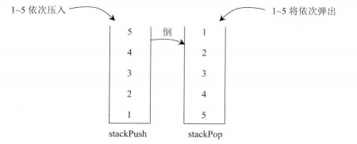

## 题目

编写一个类，用两个栈实现队列，支持队列的基本操作（`add` `poll` `peek`）

## 思路

栈的特点是先进后出，而队列的特定是先进先出，我们用两个栈正好能把顺序反过来，实现类似队列的操作。

一个栈作为压入栈，在压入数据的时候只往这个栈中压入，记为stackPush,另一个栈只作为弹出栈，在弹出数据的时候只从这个栈弹出，记为stackPop.

因为数据压入栈的时候，顺序是先进后出的，那么只要把stackPush的数据再压入stackPop中，顺序就变回来了，例如，将1-5依次压入stackPush，那么从stackPush的栈顶到栈底为5~1 ，此时依次再将5~1倒入stackPop,那么从stackPop的栈顶到栈底就变成了1~5，再从stackPop弹出时，顺序就像队列一样。



要确保两点：

1. 如果stackPush要往stackPop中压入数据，那么必须一次性的把stackPush中的数据全部压入。
2. 如果stackPop不为空，stackPush绝对不能向stackPop中压入数据。

```java
/**
 * 
 * @author zixin
 * @Desc 两个栈实现队列的功能
 */
public class Problem_02_TwoStacksImplementQueue {

	public static class TwoStacksQueue {
		//push栈
		public Stack<Integer> stackPush;
		//pop栈
		public Stack<Integer> stackPop;

		//构造函数，初始化一个push栈和一个pop栈
		public TwoStacksQueue() {
			stackPush = new Stack<Integer>();
			stackPop = new Stack<Integer>();
		}
        //添加元素，是往push栈中添加
		public void add(int pushInt) {
			stackPush.push(pushInt);
		}

		/**
		 * poll操作。如果两个都为空，说明没有元素了
		 *         当pop为空，且push不为空的时候，将push中的数据全部放入pop栈中，然后再pop栈中弹出
		 * @return
		 */
		public int poll() {
			if (stackPop.empty() && stackPush.empty()) {
				throw new RuntimeException("Queue is empty!");
			} else if (stackPop.empty()) {
				while (!stackPush.empty()) {
					stackPop.push(stackPush.pop());
				}
			}
			return stackPop.pop();
		}

		/**
		 * 均为空，则报错
		 * pop为空的情况下，将push中的数据全部放入pop，从pop中取出第一个
		 * @return
		 */
		public int peek() {
			if (stackPop.empty() && stackPush.empty()) {
				throw new RuntimeException("Queue is empty!");
			} else if (stackPop.empty()) {
				while (!stackPush.empty()) {
					stackPop.push(stackPush.pop());
				}
			}
			return stackPop.peek();
		}
	}

	public static void main(String[] args) {
		TwoStacksQueue test = new TwoStacksQueue();
		test.add(1);
		test.add(2);
		test.add(3);
		System.out.println(test.peek());
		System.out.println(test.poll());
		System.out.println(test.peek());
		System.out.println(test.poll());
		System.out.println(test.peek());
		System.out.println(test.poll());
	}

}

```

