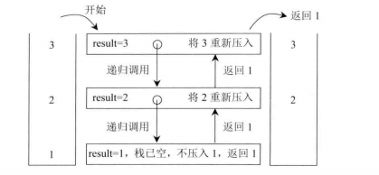
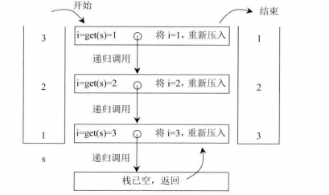

## 题目

仅用递归操作和栈逆序 一个栈。

一个栈依次压入1、2、3、4、5 那么从栈顶到栈底分别是5,4,3,2,1。将这个栈转置后，从栈顶到栈底为1、2、3、4、5，也就是实现栈中元素的逆序，但是只能用递归来实现 ，不能用其他数据结构。

## 思路

需要两个递归函数

### 递归函数一：将栈stack的栈底元素返回并移除

```java
/**
	 * @Desc 获取栈底元素返回并移除
	 * @param stack
	 * @return
	 */
	public static int getAndRemoveLastElement(Stack<Integer> stack) {
		int result = stack.pop();
		if (stack.isEmpty()) {
			return result;
		} else {
			int last = getAndRemoveLastElement(stack);
			stack.push(result);
			return last;
		}
	}

```

如果从stack的栈顶到栈底依次为3、2、1,具体执行过程如下：



### 递归方法二：逆序一个栈

```java
/**
	 * @Desc 逆序一个栈
	 * @param stack
	 */
	public static void reverse(Stack<Integer> stack) {
		if (stack.isEmpty()) {
			return;
		}
		int i = getAndRemoveLastElement(stack);
		reverse(stack);
		stack.push(i);
	}
```



## 实现

```java
package com.zixin.learn.stackandqueue;

import java.util.Stack;

public class ReverseStackUsingRecursive {

	/**
	 * @Desc 逆序一个栈
	 * @param stack
	 */
	public static void reverse(Stack<Integer> stack) {
		if (stack.isEmpty()) {
			return;
		}
		int i = getAndRemoveLastElement(stack);
		reverse(stack);
		stack.push(i);
	}

	/**
	 * @Desc 获取栈底元素返回并移除
	 * @param stack
	 * @return
	 */
	public static int getAndRemoveLastElement(Stack<Integer> stack) {
		int result = stack.pop();
		if (stack.isEmpty()) {
			return result;
		} else {
			int last = getAndRemoveLastElement(stack);
			stack.push(result);
			return last;
		}
	}

	public static void main(String[] args) {
		Stack<Integer> test = new Stack<Integer>();
		test.push(1);
		test.push(2);
		test.push(3);
		test.push(4);
		test.push(5);
		reverse(test);
		while (!test.isEmpty()) {
			System.out.println(test.pop());
		}

	}

}

```

